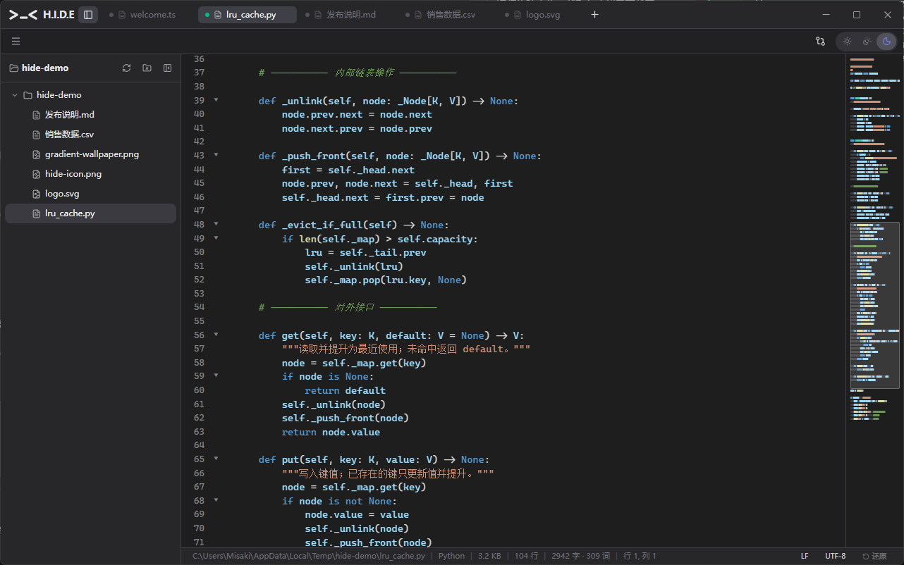
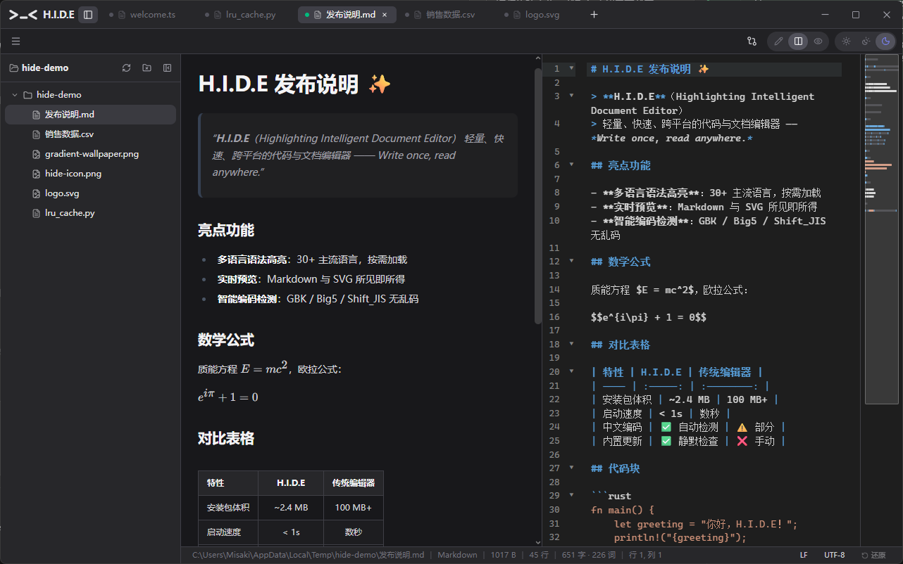
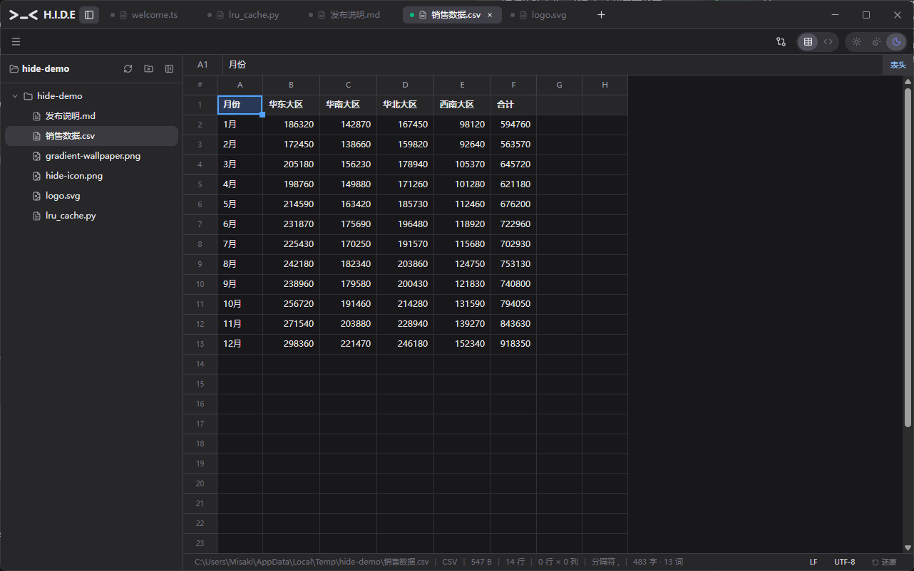
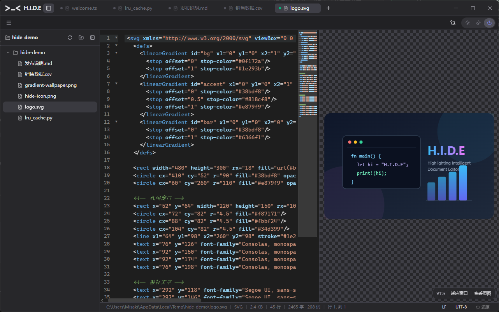
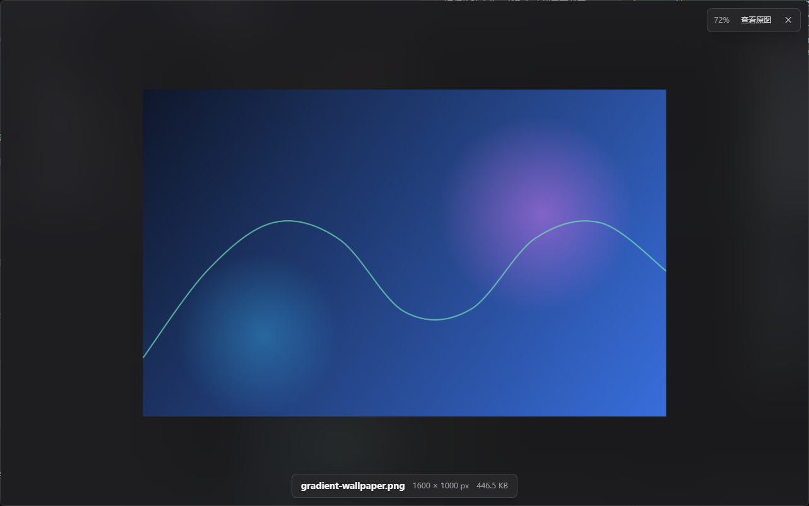
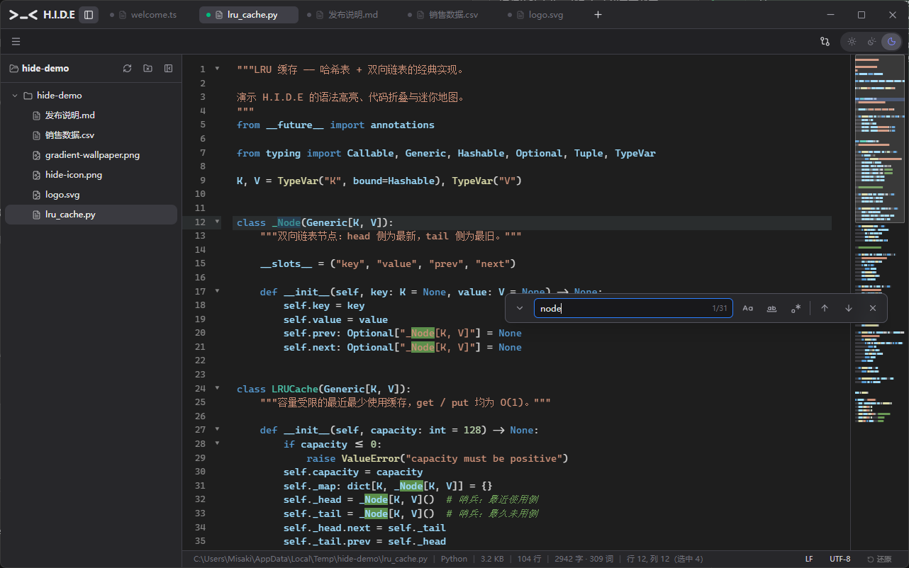

<div align="center">


# H.I.D.E

**Highlighting Intelligent Document Editor**

秒开的轻量代码 / 文档编辑器 —— 安装包约 7 MB，深浅色主题，30+ 语言语法高亮，Markdown / CSV / SVG / 图片开箱即用

[](https://github.com/misakimiku2/H.E.I.D-Editor/releases/latest)
[](https://github.com/misakimiku2/H.E.I.D-Editor/actions/workflows/ci.yml)


[下载最新版](https://github.com/misakimiku2/H.E.I.D-Editor/releases/latest) · [功能亮点](#-功能亮点) · [完整功能清单](#-完整功能清单) · [参与构建](#-参与构建)



</div>

---

## ✨ 功能亮点

### 代码编辑 · 迷你地图 · 粘性滚动

VS Code 风格的编辑体验：Canvas 语法着色迷你地图（点击/拖拽导航）、滚动时顶部固定当前作用域链、行号拖选、代码折叠、自动补全、括号匹配；30+ 语言语法高亮按需加载，主包 gzip ≈ 546 KB。


### Markdown 分屏实时预览

编辑与预览同屏滚动跟随，支持 GFM 表格、数学公式（KaTeX）、emoji、任务清单；表格在预览中可直接可视化编辑，一键导出为带内联样式的单文件 HTML。



### CSV 网格编辑器

打开 `.csv` 即进入类 Excel 网格视图：A/B/C 列标 + 行号、双击编辑、行列插入删除、拖拽填充柄、表头行开关、列宽自适应；与 Excel/WPS 剪贴板 TSV 互通，行虚拟滚动支撑大文件，随时切回文本视图。



### SVG 可视化工作台

左侧源码、右侧实时预览（blob 隔离渲染，脚本不执行），预览支持滚轮缩放、拖拽平移、适应面板/原始尺寸，透明区域棋盘格显示。切换到**编辑模式**即可在画布上直接点选元素、修改填充/描边/文本、拖拽移动，调色板一键全局换色，导出 PNG——修改以「手术式」写回源码，注释与缩进逐字保留。



### 内置图片查看器

文件树点开图片即查看：大于窗口自动适应、小于窗口保持原始尺寸，光标锚点缩放、拖拽平移、1:1 切换，底部信息栏显示文件名 / 像素尺寸 / 文件大小。



### 查找 / 替换 · 一应俱全

`Ctrl+F` / `Ctrl+H` / `Ctrl+G`：正则、大小写、全词匹配、`$1` 引用替换、全部匹配高亮 + 计数；Markdown 纯预览态检索渲染后文本。文件树 / 编辑器 / 标签栏全场景右键菜单。



## 📋 完整功能清单

**编辑器核心**

- 30+ 语言语法高亮（TypeScript / Python / Rust / Go / Java / C 系 / Markdown / SQL / Shell 等），语言包按需加载
- 迷你地图（Canvas 语法着色，点击/拖拽导航）、粘性滚动（作用域链 + 点击跳转）、代码折叠、行号拖选
- 括号匹配 / 自动闭合、选中高亮匹配、自动补全
- 查找 / 替换 / 跳转到行：正则、大小写、全词、`$1` 引用替换，全部匹配高亮 + 计数；Markdown 预览态独立查找（CSS Custom Highlight API）
- 多标签页：脏状态标记、关闭确认、标签右键菜单（新建 / 关闭其他 / 关闭全部）、`Ctrl+Tab` 切换；桌面支持标签拖拽——栏内重排、拖出脱离成新窗口、跨窗口合并，重启按窗口还原会话
- 性能保护：超 200 万字符自动降级（状态栏标注）、二进制文件只读预览
- 打印 / 导出 PDF：`Ctrl+P` 调起系统打印（WebView2 打印对话框自带「另存为 PDF」），Markdown / CSV / 文本按类型排版

**文件处理**

- 本地文件读写：原生对话框、拖拽进窗即开、最近打开（15 条）、可选文件树侧栏（懒加载 + 递归监视自动刷新 + 右键文件管理：新建 / 重命名 / 复制 / 删除 / 在资源管理器中显示）
- 超大文件：32MB ~ 512MB 只读分块预览（虚拟滚动 + 跳转到行），> 512MB 拒绝打开并给替代建议
- 跨文件搜索：文件树侧栏内嵌，正则 / 大小写 / 全词，命中高亮 + 点击定位；十六进制查看（16 字节/行）
- 编码：UTF-8 / UTF-8 BOM / UTF-16 / GBK / GB18030 / Big5 / Shift_JIS 自动检测，状态栏一键「以编码重新打开」或「转换编码并保存」
- 换行符：CRLF / LF / CR 保留原样，一键转换
- 文件关联与单实例：42 种扩展名注册「打开方式」与「默认应用」（可按类型把 H.I.D.E 设为默认编辑器），资源管理器右键「用 H.I.D.E 打开」，二次启动聚焦已有窗口
- 外部修改检测：diff 时间线逐条对比采纳（桌面）

**内容格式**

- Markdown：分屏实时预览（滚动跟随）、GFM 表格可视化编辑、数学公式 / emoji / 高亮上下标、格式化工具栏、页签组导入编辑、导出单文件 HTML、网址导入转 Markdown、大纲导航浮窗（滚动跟随 + 层级折叠）、粘贴图片自动落盘与远程图片本地化
- CSV：网格 / 文件双视图、分隔符自动识别、只读态排序与筛选（不改写数据）、大文件性能保护
- JSON / YAML：结构树 / 分屏 / 文本三视图，两侧同步滚动、格式化、折叠浏览与标量复制
- SVG：可视化工作台（源码 + 隔离预览 + 缩放平移）+ 可视化编辑（点选 / 拖拽 / 属性面板 / 调色板换色 / PNG 导出）
- 图片：内置查看器（智能初始尺寸 / 缩放 / 平移 / 信息栏）

**应用体验**

- 深色 / 浅色 / 跟随系统主题，界面中英双语
- 设置面板：字体 / 字号 / 行高 / Tab 宽度 / 缩进 / 自动换行 / 空白符 / 小地图 / 粘性滚动 / 语言 / 自动保存间隔
- 状态栏：路径、语言、行列与选中数、字数统计（CJK 感知）、换行符、编码
- 自动保存（可选）+ 草稿恢复：异常退出后随会话恢复未保存内容
- 会话恢复：重启还原标签页（含编码与换行符），多窗口按窗还原
- 应用内自动更新：启动静默检查（每次启动必检），确认后下载安装并重启；更新说明自动打开并可回看历史版本
- 无边框窗口 + 自定义标题栏（拖拽 / 双击最大化 / 关闭确认）

<details>
<summary><strong>⌨️ 默认快捷键</strong></summary>

| 快捷键 | 功能 | 快捷键 | 功能 |
| --- | --- | --- | --- |
| `Ctrl+N` | 新建 | `Ctrl+F` | 查找 |
| `Ctrl+O` | 打开 | `Ctrl+H` | 替换 |
| `Ctrl+S` | 保存 | `Ctrl+G` | 跳转到行 |
| `Ctrl+Shift+S` | 另存为 | `Ctrl+Z` / `Ctrl+Y` | 撤销 / 重做 |
| `Ctrl+W` | 关闭标签 | `Ctrl+Tab` | 切换标签 |

菜单「键盘快捷键」有完整列表。

</details>

## 📦 下载安装

到 [Releases](https://github.com/misakimiku2/H.E.I.D-Editor/releases/latest) 下载：

| 文件 | 说明 |
| --- | --- |
| `H.I.D.E_*_x64-setup.exe` | Windows 安装程序（NSIS 简体中文向导，自动注册文件关联） |
| `H.I.D.E_*_arm64.apk` | Android 侧载 APK（arm64，**release 签名**，Android 7.0+） |

- **系统要求**：Windows 10/11（WebView2 系统默认自带）· Android 7.0（API 24）及以上
- **支持平台只有这两个**：不做 macOS 版，也不做 Linux 版 —— 这是定下来的结论，不是「还没排上期」。
  把「秒开、约 7 MB、够用」做深比多挂两条平台线更值钱：macOS 要付费开发者证书 + 公证才过得了
  Gatekeeper，Linux 的 WebView 是 WebKitGTK 而非本项目全程验证所在的 Blink/Chromium 内核，
  两条线各要一套发布链路加一整套界面重验。评估依据逐条记在 [docs/ROADMAP.md](docs/ROADMAP.md) 条目 40
- **应用内更新**：桌面端启动后静默检查新版本（每次启动必检），发现新版会弹窗确认并自动完成更新；
  安卓端无静默更新通道，检测到新版会弹卡片跳 Releases 页手动安装 APK
- **安卓 v1.3.x 老包升级**：v1.4.0 起 APK 改用 release 签名，与 v1.3.0 及更早的 debug 包签名
  不一致，**需先卸载旧包再装新版**（卸载不动磁盘上的文件）；此后各版可直接覆盖安装
- **便携运行**：安装目录下的 `nexus-editor.exe` 也可直接运行

> 纯浏览器模式（`npm run dev`）下文件读写自动降级为浏览器 File System Access API / 下载。

## 🛠 参与构建

### 桌面（Windows）

```bash
npm install                 # 安装前端与 Tauri CLI 依赖
npm run tauri:build         # 编译 Rust 并打包（首次约 4-10 分钟）
```

产物位置：

- **独立可执行文件**：`src-tauri/target/release/nexus-editor.exe`
- **安装程序**：`src-tauri/target/release/bundle/nsis/H.I.D.E_<版本>_x64-setup.exe`

### 注册为系统编辑器

安装包在安装完成时会自动写入外壳集成注册（`src-tauri/nsis/installer-hooks.nsh`）：
把 H.I.D.E 加入「打开方式」候选、登记进「设置 → 默认应用」、并添加资源管理器右键
「用 H.I.D.E 打开」。卸载时由同一钩子精确回滚，不影响其他编辑器的注册。

已装旧版本不想重装、或开发调试时，可直接执行等价脚本：

```powershell
npm run register:shell     # 写入：打开方式候选 + 默认应用清单 + 右键菜单
npm run unregister:shell   # 撤销上述注册
```

> Windows 10/11 禁止程序静默篡改「默认程序」（UserChoice 带哈希校验），
> 脚本与安装包只把 H.I.D.E 注册为**候选**；设为默认需在
> 设置 → 应用 → 默认应用 中手动选择一次。

### 安卓（Android 7.0 / API 24+）

```bash
npm install
rustup target add aarch64-linux-android armv7-linux-androideabi i686-linux-android x86_64-linux-android
# 需 ANDROID_HOME / NDK_HOME / JAVA_HOME 环境变量（NDK 通过 Android Studio SDK Manager 安装）

npm run tauri android init      # 首次：生成 src-tauri/gen/android（已入库，含定制）
npm run tauri android dev       # 连接设备/模拟器热更新调试
npm run tauri android build -- --apk --debug --target aarch64   # debug APK（可 adb install、可 CDP 调试）
npm run tauri android build -- --apk --target aarch64           # release APK（需本地 keystore.properties，见 docs/RELEASE.md）
```

> ⚠️ `--` 分隔符不能省：直接写 `build --apk` 时 npm 会把 `--apk` 吃掉，
> Tauri 退回默认产物（release **AAB**，既不能直接装也不能调试）。

产物：`src-tauri/gen/android/app/build/outputs/apk/universal/{debug,release}/*.apk`，`adb install -r` 安装即可。
真机 ARM 平板加 `--target aarch64`（只编 arm64，构建与传输都快一大截；产物名仍叫 universal，
里面实际只有 arm64 库，`unzip -l … | grep 'lib/'` 可核对）。

#### 安卓端适配要点

- **手机**：顶栏（标签列表 / 文件名 / 文件树 / 视图切换 / 溢出菜单）+ 底部工具栏（打开 / 撤销 / 保存 / 重做 / 查找），精简状态栏（语言·编码·换行·行列，后两项可点），无分屏与小地图
- **手机的设置、查找与文件树**（v1.4.1 反馈后调整）：设置是**整页**（顶栏返回 + 底栏「恢复默认 / 完成」），不是弹窗——平板与桌面仍用弹窗；查找 / 替换贴在**窗口底缘**停靠（整幅宽度），键盘弹出时按 `--heid-kb` 上移，因此不会被输入法盖住，也不受文件树挤占编辑区的影响（桌面与平板仍是指针定位浮层）；文件树与平板一样是**推拉式侧栏**（挤压编辑区、右缘可拖宽），不再是覆盖抽屉，并支持**横向左滑收起**——树上、行号栏、代码视图里起手都算（树开着时编辑区只剩 1/3 屏，那儿横向拖动没有用途），右边缘跟手、松手回弹或收拢，不是硬切（手机独有手势，平板与桌面没有）。手机树宽按视口比例给：默认 2/3 屏、最宽 4/5，行与按钮 48dp；平板树保持 v1.4 的 40dp 行 / 36dp 图标按钮原样
- **平板（≥768px）**：沿用桌面布局（标签条 / 三视图切换 / 分屏 / 推拉式文件树），≥1024px 启用小地图与粘性滚动；菜单栏常驻一排纯图标高频按钮（打开 / 保存 / 撤销 / 重做 / 从网址导入 / 设置 / 分享 / 文件夹树）
- **触屏交互**（v1.4 起）：长按 = 右键菜单（标签栏 / 文件树 / Markdown 预览 / 大纲 / JSON 树 / CSV）；双指捏合缩放 + 单指平移（图片、SVG 预览与编辑画布）；CSV 用长按菜单与选区把手替代桌面的拖拽填充柄；长按文字让位系统选字，Markdown 选区上方浮出复制 / 格式化工具条。全部由 `IS_TOUCH_PRIMARY` 与 `pointer-coarse` 门控，桌面行为不变
- **触控目标**：主要触点 ≥44dp（关键操作 48dp），hover 样式包在 `@media (hover:hover) and (pointer:fine)`，自定义滚动条只在桌面出现。
  手机端本轮改到的界面（设置整页、顶栏与溢出菜单、查找 / 替换、精简状态栏、TabSheet、下拉、文件树）按 **≥48dp** 收口，CDP 整屏实测除编辑器行号 / 折叠槽外 0 项不达标；
  其余触屏界面（CSV 网格菜单、SVG 工作台、Markdown 选区工具条）仍是 44dp 档，尚未统一到 48
- **快捷键提示**：接入物理键盘时才显示 `Ctrl+…` 提示（Kotlin 侧 `InputManager` 枚举与插拔事件上报，软键盘不算）
- **文件访问**：系统 SAF 文件选择器（`ACTION_OPEN_DOCUMENT` / `CREATE_DOCUMENT`），支持多选；读写授权经 `takePersistableUriPermission` 持久化，重启后会话恢复可用（见 `src-tauri/gen/android/.../MainActivity.kt` 的 `HeidBridge`）；树内可直接新建 / 重命名 / 删除
- **返回键**：逐层关闭弹层，最后弹出未保存退出确认
- **外部修改 diff / 文件监听**：安卓版不实现（fs watch 不支持 Android 且 SAF 无真实路径）
- **发布签名**：release APK 用独立 keystore 签名（`src-tauri/gen/android/keystore.properties`，不入库），与 v1.3.x 及更早的 debug 包签名不同，跨该边界升级需先卸载一次

### 开发调试

```bash
npm test             # vitest 单元测试
npm run dev          # 仅前端（浏览器访问 http://localhost:5188）
npm run tauri:dev    # 桌面窗口 + 热更新
```

### 发布流程

见 [docs/RELEASE.md](docs/RELEASE.md)：更新签名密钥、GitHub secrets、`v*` 标签触发 CI 自动构建签名安装包与 `latest.json` 并创建 Release。

## 📁 项目结构

```
├── src/                      # 前端（React 19 + Vite + Tailwind v4）
│   ├── main.tsx              # 入口（安卓安全区引导）
│   ├── App.tsx               # 主界面：标签页 / 工具栏 / 状态栏 / 文件读写适配 / 平台分支
│   ├── components/
│   │   ├── CodeEditor.tsx    # 核心编辑器（迷你地图 / 粘性滚动 / 行号拖选）
│   │   ├── MarkdownPreview.tsx # Markdown 预览 / 表格可视化编辑 / 图片插入
│   │   ├── MarkdownTools.tsx # Markdown 格式化菜单与转换逻辑
│   │   ├── CsvGridEditor.tsx # CSV 网格视图（虚拟滚动 / 填充柄 / TSV 互通）
│   │   ├── SvgWorkbench.tsx  # SVG 源码 + 实时预览工作台
│   │   ├── ImageViewer.tsx   # 内置图片查看器
│   │   ├── FileTreeSidebar.tsx # 可选文件树侧栏 + 右键文件管理
│   │   ├── FindReplaceBar.tsx / PreviewFindBar.tsx / DiffModal.tsx
│   │   ├── SettingsDialog.tsx / ShortcutHelpDialog.tsx / UrlImportModal.tsx
│   │   ├── ContextMenu.tsx / AlertDialog.tsx / ConfirmDialog.tsx（毛玻璃弹窗）
│   │   └── mobile/           # 移动端组件（TopAppBar / BottomToolbar / TabSheet / Sheet）
│   ├── hooks/                # useUpdater / useFileActions / useExternalFileWatcher 等 9 个
│   └── lib/                  # codemirror 主题与语言 / 编码检测 / i18n / 会话 / 草稿 / 查找引擎…
├── scripts/                  # register-shell-integration.ps1（系统编辑器注册 / 撤销）
└── src-tauri/                # Tauri 壳（Rust + Android 工程）
    ├── tauri.conf.json       # 窗口（无边框）/ 文件关联 / 更新器 / NSIS 打包配置
    ├── nsis/                 # 安装钩子：打开方式候选 / 默认应用 / 右键菜单注册
    ├── capabilities/         # fs 读写、对话框、窗口控制、更新器权限（桌面/全平台分文件）
    ├── src/                  # lib.rs + encoding / fsops / http / render / external 模块
    └── gen/android/          # Android Studio 工程（入库，含 MainActivity 定制）
```

## 🎯 设计原则

H.I.D.E 的定位是「**秒开、约 7 MB、够用的编辑器**」。明确不做：插件系统、LSP、内嵌终端、Git 集成、账号云同步、AI 面板常驻 —— 需要这些时请用 VS Code；规划详见 [docs/ROADMAP.md](docs/ROADMAP.md)。
