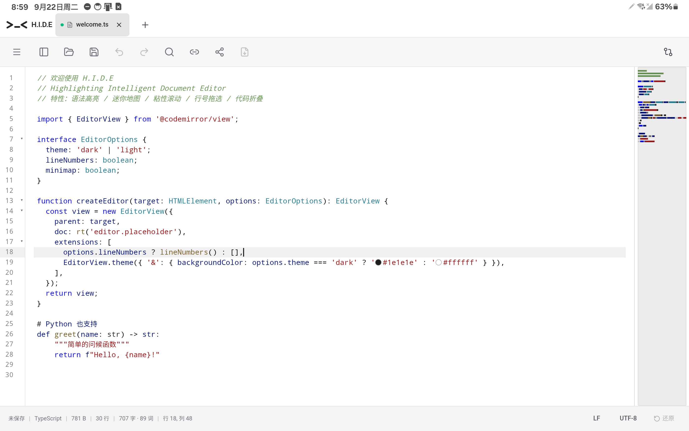
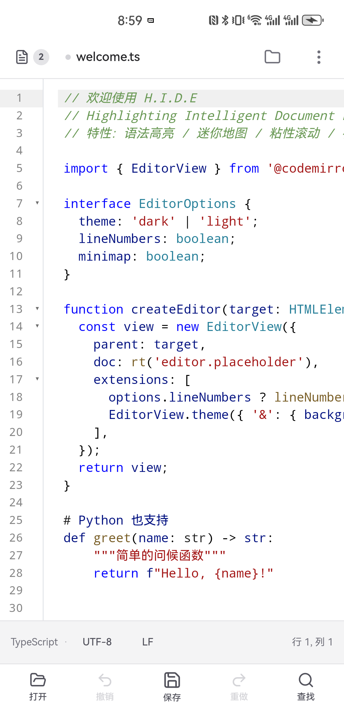

<div align="center">


# H.I.D.E

**Highlighting Intelligent Document Editor**

秒开的轻量代码 / 文档编辑器 —— Windows 安装包约 7 MB，安卓手机与平板同为一等公民；深浅色主题，31 种语言语法高亮，Markdown / CSV / SVG / 图片开箱即用

[](https://github.com/misakimiku2/H.E.I.D-Editor/releases/latest)
[](https://github.com/misakimiku2/H.E.I.D-Editor/actions/workflows/ci.yml)


[下载最新版](https://github.com/misakimiku2/H.E.I.D-Editor/releases/latest) · [功能亮点](#-功能亮点) · [安卓端](#-安卓端手机与平板) · [完整功能清单](#-完整功能清单) · [参与构建](#-参与构建)


</div>

---

## ✨ 功能亮点

### 代码编辑 · 迷你地图 · 粘性滚动

VS Code 风格的编辑体验：Canvas 语法着色迷你地图（点击/拖拽导航）、滚动时顶部固定当前作用域链、行号拖选、代码折叠、自动补全、括号匹配。语言包按需加载——首屏只拉 1 个 JS + 1 个 CSS（gzip ≈ 834 KB），其余 296 个 chunk 用到才取。

行内出现 `#1e1e1e` 这类颜色字面量时会画一个取色圆点，点开是取色器，选完以最小补丁写回源码。


### Markdown 分屏实时预览

编辑与预览同屏滚动跟随，支持 GFM 表格、数学公式（KaTeX）、emoji、任务清单；表格在预览中可直接可视化编辑，行列增删点一下就行。Mermaid 图表渲染后悬停即出「编辑」，在对话框里改源码并实时预览。可一键导出为带内联样式的单文件 HTML。


### CSV 网格编辑器

打开 `.csv` 即进入类 Excel 网格视图：A/B/C 列标 + 行号、双击编辑、行列插入删除、拖拽填充柄、表头行开关、列宽自适应；与 Excel/WPS 剪贴板 TSV 互通，行虚拟滚动支撑大文件，随时切回文本视图。


### SVG 可视化工作台

左侧源码、右侧实时预览（blob 隔离渲染，脚本不执行），预览支持滚轮缩放、拖拽平移、适应面板/原始尺寸，透明区域棋盘格显示。切换到**编辑模式**即可在画布上直接点选元素、修改填充/描边/文本、拖拽移动，检查面板还能按 1 个 SVG 用户单位精确步进位移；调色板一键全局换色，导出 PNG——修改以「手术式」写回源码，注释与缩进逐字保留。


### 内置图片查看器

文件树点开图片即查看：大于窗口自动适应、小于窗口保持原始尺寸，光标锚点缩放、拖拽平移、1:1 切换，底部信息栏显示文件名 / 像素尺寸 / 文件大小。


### 查找 / 替换 · 一应俱全

`Ctrl+F` / `Ctrl+H` / `Ctrl+G`：正则、大小写、全词匹配、`$1` 引用替换、全部匹配高亮 + 计数；Markdown 纯预览态检索渲染后文本。文件树 / 编辑器 / 标签栏全场景右键菜单。触屏端这条同样顺手，见[安卓端](#-安卓端手机与平板)。


### 安卓：手机与平板两套骨架

同一份代码，按屏宽与指针类型分档：手机（<768px）用自己的顶栏 + 底部工具栏 + 精简信息栏，平板（≥768px）沿用桌面布局并把触点放大到触屏人体工学。长按出菜单、双指捏合、单指平移、SAF 里直接建文件改名删除都按触屏习惯重做，不是「能打开文件的桌面壳」。

<table>
<tr>
<td></td>
<td></td>
</tr>
<tr>
<td align="center">平板（Galaxy Tab S8）</td>
<td align="center">手机（Mate 40 Pro）</td>
</tr>
</table>

## 📋 完整功能清单

**编辑器核心**

- 31 种语言的**语法高亮**（TypeScript / JavaScript / TSX / JSX / Python / Rust / Go / Java / C / C++ / C# / Kotlin / Scala / Ruby / Swift / PHP / CSS / SCSS / Less / HTML / JSON / YAML / TOML / XML / SVG / SQL / Shell / Dockerfile / INI / Makefile / Markdown），语言包按需加载；CSV 有专门的表格视图，纯文本本就不需要着色器
- 迷你地图（Canvas 语法着色，点击/拖拽导航）、粘性滚动（作用域链 + 点击跳转）、代码折叠、行号拖选
- 括号匹配 / 自动闭合、选中高亮匹配、自动补全
- 颜色字面量行内取色圆点 + 取色器（色相 / 饱和度 / 透明度 / 十六进制），改完以最小补丁写回源码
- 查找 / 替换 / 跳转到行：正则、大小写、全词、`$1` 引用替换，全部匹配高亮 + 计数；Markdown 预览态独立查找（CSS Custom Highlight API，老内核自动降级为不画高亮）
- 多标签页：脏状态标记、关闭确认、标签右键菜单（新建 / 关闭其他 / 关闭全部）、`Ctrl+Tab` 切换；桌面支持标签拖拽——栏内重排、拖出脱离成新窗口、跨窗口合并，重启按窗口还原会话
- 性能保护：超 200 万字符自动降级（状态栏标注，关粘性滚动等重渲染开销）、二进制文件只读预览
- 打印 / 导出 PDF（桌面）：`Ctrl+P` 调起系统打印（WebView2 打印对话框自带「另存为 PDF」），Markdown / CSV / 文本按类型排版；安卓无打印入口，改走系统分享

**文件处理**

- 本地文件读写：原生对话框、拖拽进窗即开、最近打开（保留 15 条，菜单列 10 条、欢迎页列 5 条）、可选文件树侧栏（懒加载 + 递归监视自动刷新 + 右键文件管理：新建 / 重命名 / 复制 / 删除 / 在资源管理器中显示）
- 超大文件：32MB ~ 512MB 只读分块预览（虚拟滚动 + 跳转到行），> 512MB 拒绝打开并给替代建议
- 跨文件搜索（桌面）：文件树侧栏内嵌，正则 / 大小写 / 全词，命中高亮 + 点击定位；十六进制查看（16 字节/行）——这两项要真实路径，安卓的 SAF uri 拿不到，故只在桌面可用
- 编码：UTF-8 / UTF-8 BOM / UTF-16 / GBK / GB18030 / Big5 / Shift_JIS 自动检测，状态栏一键「以编码重新打开」或「转换编码并保存」
- 换行符：CRLF / LF / CR 保留原样，一键转换
- 文件关联与单实例：42 种扩展名注册「打开方式」与「默认应用」（可按类型把 H.I.D.E 设为默认编辑器），资源管理器右键「用 H.I.D.E 打开」，二次启动聚焦已有窗口
- 修改对比：外部修改检测以 diff 时间线逐条对比采纳，软件内改动同样留时间线（桌面）

**内容格式**

- Markdown：分屏实时预览（滚动跟随）、GFM 表格可视化编辑（含行列增删）、数学公式 / emoji / 高亮上下标、Mermaid 图表（渲染 + 可视化编辑）、格式化工具栏、页签组导入编辑、导出单文件 HTML、网址导入转 Markdown、大纲导航浮窗（滚动跟随 + 层级折叠）、粘贴图片自动落盘与远程图片本地化、插入图片对话框
- CSV：网格 / 文件双视图、分隔符自动识别、只读态排序与筛选（不改写数据）、大文件性能保护
- JSON / YAML：结构树 / 分屏 / 文本三视图，两侧同步滚动、格式化、折叠浏览与标量复制
- SVG：可视化工作台（源码 + 隔离预览 + 缩放平移）+ 可视化编辑（点选 / 拖拽 / 属性面板含位移步进 / 调色板换色 / PNG 导出）
- 图片：内置查看器（智能初始尺寸 / 缩放 / 平移 / 信息栏）

**应用体验**

- 深色 / 浅色 / 跟随系统主题（安卓恒跟随系统），界面中英双语
- 设置面板：字体 / 字号 / 行高 / 代码配色主题 / Tab 宽度 / 缩进方式 / 自动换行策略 / 空白符 / 颜色装饰 / 小地图 / 粘性滚动 / 语言 / 自动保存间隔
- 状态栏：路径、语言、行列与选中数、字数统计（CJK 感知）、换行符、编码
- 自动保存（可选）+ 草稿恢复：异常退出后随会话恢复未保存内容
- 会话恢复：重启还原标签页（含编码与换行符），多窗口按窗还原
- 应用内自动更新：启动静默检查（每次启动必检），确认后下载安装并重启；更新说明自动打开为只读标签页，「关于 → 更新文档」可回看历史版本（保留最近 20 份）
- 无边框窗口 + 自定义标题栏（拖拽 / 双击最大化 / 关闭确认）

<details>
<summary><strong>⌨️ 默认快捷键</strong></summary>

| 快捷键 | 功能 | 快捷键 | 功能 |
| --- | --- | --- | --- |
| `Ctrl+N` | 新建 | `Ctrl+F` | 查找 |
| `Ctrl+O` | 打开 | `Ctrl+H` | 替换 |
| `Ctrl+S` | 保存 | `Ctrl+G` | 跳转到行 |
| `Ctrl+Shift+S` | 另存为 | `Ctrl+Z` / `Ctrl+Y` | 撤销 / 重做 |
| `Ctrl+W` | 关闭标签 | `Ctrl+Tab` | 切换标签 |

菜单「键盘快捷键」有完整列表。触屏端没有快捷键，这些动作都有按钮或手势出口。

</details>

## 📱 安卓端（手机与平板）

自 v1.4 起安卓是专项适配过的移动端，v1.4.1 收掉最后两个尾巴并按真机反馈修了一轮。手机与平板共用一个 arm64 APK。

### 两套布局

- **手机（<768px）**：顶栏（标签列表 / 文件名 / 文件树 / 视图切换 / 溢出菜单）+ 底部工具栏（打开 / 撤销 / 保存 / 重做 / 查找）+ 精简状态栏（语言·编码·换行·行列，后两项可点切换），无分屏与小地图
- **平板（≥768px）**：沿用桌面布局（标签条 / 三视图切换 / 分屏 / 推拉式文件树），≥1024px 启用小地图与粘性滚动；菜单栏常驻一排纯图标高频按钮（菜单 / 文件树开合 / 打开 / 保存 / 撤销 / 重做 / **查找** / 从网址导入 / 分享 / 导出 HTML），低频项留在主菜单

### 触屏操作

- **长按 = 右键**：标签栏 / 文件树 / Markdown 预览 / 大纲 / JSON 树 / CSV 网格全部接入右键菜单的触屏变体，触发时给一次轻触觉；长按文字则让位系统选字
- **查找 / 替换 / 跳行**：贴在窗口底缘整幅停靠（平板保持桌面同款一行布局，手机两行重排），键盘弹出时按 `--heid-kb` 上移所以不会被输入法盖住；栏上的按钮不会吞掉输入法（拦 `mousedown` 的默认动作 + 焦点在查找 / 替换 / 行号框之间交接）；`#` 开关是「跳转到行」的触屏入口
- **Markdown**：选区上方浮出复制 / 粘贴 / 全选 / 重复上次格式化 / 更多；表格单击单元格浮出「行+ / 行− / 列+ / 列−」结构条，钉在键盘之上
- **图片 / SVG**：双指捏合缩放（锚点 = 双指中点）、单指平移、双击回 1:1；SVG 编辑画布空白处单指拖 = 平移，元素拖拽优先于平移
- **SVG 精确位移**：检查面板属性页的位移 X/Y 输入框 + ± 步进，一步 1 个 SVG 用户单位——手指拖不出这个精度
- **CSV**：长按出与桌面同款的单元格 / 行 / 列菜单，另补全选、向下 / 向右填充、行列移动、行高列宽步进；拖拽改用 Pointer 事件（WebView 拖拽过程中不发 `mousemove`，这是桌面好用而平板点不动的根因）
- **文件树**：手机与平板都是推拉式侧栏（挤压编辑区、右缘可拖宽），手机上额外支持横向左滑收起；树内可直接新建 / 重命名 / 删除（经 SAF），剪切 / 复制 / 在文件管理器中显示系统不提供，置灰而非假装可用
- **系统分享**：安卓没有打印对话框，高频出口改为「分享」，把当前文件内容调起系统分享面板发出去
- **返回键**：逐层关闭弹层，最后弹出未保存退出确认
- **快捷键提示**：接入物理键盘时才显示 `Ctrl+…`（Kotlin 侧 `InputManager` 枚举与插拔事件上报，软键盘不算），没键盘时不出现看不懂的空提示
- **设置**：手机端是整页（顶栏返回 + 底栏「恢复默认 / 完成」），平板与桌面仍是居中弹窗

### 兼容与触控

- 最低 Android 7.0（API 24）。**老内核 WebView 已实测过**：华为 Mate 40 Pro 自带的 Chrome 99 上，Tailwind v4 按 chrome 111 基线产出的 `oklch()` 实心色、`dvh`、滤镜链里的空 `var()`、独立 `rotate:` / `translate:` 属性会同时静默失效（表现为边框变实线、整屏高度塌陷、毛玻璃消失、浮条偏半个身位）。构建产物落盘后由 `scripts/webview-css-fallback.mjs` 统一降级，`ring-*` 有意不降级（原因记在该脚本与构建文档里）
- 触控目标：手机与平板的主要触点统一在 **≥48dp** 档（平板菜单栏与状态栏这一轮从 44 / 48 混排统一到 48），hover 样式包在 `@media (hover:hover) and (pointer:fine)`，自定义滚动条只在桌面出现，触屏退回系统悬浮条

### 安卓端不做 / 尚未做

- **源码编辑器的行号槽**（点选整行、拖动多选、悬停提示）整体关闭：那 153 行交互全挂在 mouse 事件上，迁到 pointer 会动到桌面路径
- **行内取色圆点 11.9dp**、**平板标签页关闭按钮 28dp**（嵌在标签内部，扩到 48dp 会与相邻标签命中区重叠，替代路径是长按标签出菜单关闭）
- 弹窗层（设置 / 关于 / Diff / 图片插入 / 确认框）、CSV 网格菜单、Markdown 表格结构条仍在 44dp 档，未统一到 48
- **打印 / 导出 PDF 无入口**（WebView 无系统打印对话框），用系统分享或桌面端打印
- **外部修改检测 / 文件监听不做**（fs watch 不支持 Android，SAF 也拿不到真实路径），文件被别处改过需重新打开；跨文件搜索与十六进制查看同理不可用
- 只出 arm64 一个包，32 位 armeabi-v7a 与 x86 设备装不上

## 📦 下载安装

到 [Releases](https://github.com/misakimiku2/H.E.I.D-Editor/releases/latest) 下载：

| 文件 | 说明 |
| --- | --- |
| `H.I.D.E_*_x64-setup.exe` | Windows 安装程序（NSIS 简体中文向导，自动注册文件关联），约 7 MB |
| `H.I.D.E_*_arm64.apk` | Android 侧载 APK（arm64，**release 签名**，Android 7.0+，手机与平板同一个包） |

- **系统要求**：Windows 10/11（WebView2 系统默认自带）· Android 7.0（API 24）及以上
- **支持平台只有这两个**：不做 macOS 版，也不做 Linux 版 —— 这是定下来的结论，不是「还没排上期」。
  把「秒开、约 7 MB、够用」做深比多挂两条平台线更值钱：macOS 要付费开发者证书 + 公证才过得了
  Gatekeeper，Linux 的 WebView 是 WebKitGTK 而非本项目全程验证所在的 Blink/Chromium 内核，
  两条线各要一套发布链路加一整套界面重验。评估依据逐条记在 [docs/ROADMAP.md](docs/ROADMAP.md) 条目 40
- **应用内更新**：桌面端启动后静默检查新版本（每次启动必检），发现新版会弹窗确认并自动完成更新；
  安卓端无静默更新通道，检测到新版会弹卡片跳 Releases 页手动安装 APK
- **安卓 v1.3.x 老包升级**：v1.4.0 起 APK 改用 release 签名，与 v1.3.0 及更早的 debug 包签名
  不一致，**需先卸载旧包再装新版**（卸载不动磁盘上的文件）；此后各版可直接覆盖安装
- **便携运行**：安装目录下的 `nexus-editor.exe` 也可直接运行

> 纯浏览器模式（`npm run dev`）下文件读写自动降级为浏览器 File System Access API / 下载。

## 🛠 参与构建

### 桌面（Windows）

```bash
npm install                 # 安装前端与 Tauri CLI 依赖
npm run tauri:build         # 编译 Rust 并打包（首次约 4-10 分钟）
```

产物位置：

- **独立可执行文件**：`src-tauri/target/release/nexus-editor.exe`
- **安装程序**：`src-tauri/target/release/bundle/nsis/H.I.D.E_<版本>_x64-setup.exe`

### 注册为系统编辑器

安装包在安装完成时会自动写入外壳集成注册（`src-tauri/nsis/installer-hooks.nsh`）：
把 H.I.D.E 加入「打开方式」候选、登记进「设置 → 默认应用」、并添加资源管理器右键
「用 H.I.D.E 打开」。卸载时由同一钩子精确回滚，不影响其他编辑器的注册。

已装旧版本不想重装、或开发调试时，可直接执行等价脚本：

```powershell
npm run register:shell     # 写入：打开方式候选 + 默认应用清单 + 右键菜单
npm run unregister:shell   # 撤销上述注册
```

> Windows 10/11 禁止程序静默篡改「默认程序」（UserChoice 带哈希校验），
> 脚本与安装包只把 H.I.D.E 注册为**候选**；设为默认需在
> 设置 → 应用 → 默认应用 中手动选择一次。

### 安卓（Android 7.0 / API 24+）

```bash
npm install
rustup target add aarch64-linux-android armv7-linux-androideabi i686-linux-android x86_64-linux-android
# 需 ANDROID_HOME / NDK_HOME / JAVA_HOME 环境变量（NDK 通过 Android Studio SDK Manager 安装）

npm run tauri android init      # 首次：生成 src-tauri/gen/android（已入库，含定制）
npm run tauri android dev       # 连接设备/模拟器热更新调试
npm run tauri android build -- --apk --debug --target aarch64   # debug APK（可 adb install、可 CDP 调试）
npm run tauri android build -- --apk --target aarch64           # release APK（需本地 keystore.properties，见 docs/RELEASE.md）
```

> ⚠️ `--` 分隔符不能省：直接写 `build --apk` 时 npm 会把 `--apk` 吃掉，
> Tauri 退回默认产物（release **AAB**，既不能直接装也不能调试）。

产物：`src-tauri/gen/android/app/build/outputs/apk/universal/{debug,release}/*.apk`，`adb install -r` 安装即可。
真机 ARM 平板加 `--target aarch64`（只编 arm64，构建与传输都快一大截；产物名仍叫 universal，
里面实际只有 arm64 库，`unzip -l … | grep 'lib/'` 可核对）。

### 开发调试

```bash
npm test             # vitest 单元测试
npm run dev          # 仅前端（浏览器访问 http://localhost:5188）
npm run tauri:dev    # 桌面窗口 + 热更新
```

触屏改动一般在模拟器上真 touch 事件 + WebView CDP 实测（量 `getBoundingClientRect` 校触点尺寸），
`scripts/cdp-*.mjs` 是那套探针（审计、长按、拖拽、捏合）。

### 发布流程

见 [docs/RELEASE.md](docs/RELEASE.md)：更新签名密钥、GitHub secrets、`v*` 标签触发 CI 自动构建签名安装包与 `latest.json` 并创建 Release。

## 📁 项目结构

```
├── src/                      # 前端（React 19 + Vite + Tailwind v4）
│   ├── main.tsx              # 入口（安卓安全区引导）
│   ├── App.tsx               # 主界面：标签页 / 工具栏 / 状态栏 / 文件读写适配 / 平台分支
│   ├── components/           # 31 个组件，按视图分：
│   │   ├── CodeEditor.tsx    #   核心编辑器（迷你地图 / 粘性滚动 / 行号拖选 / 取色圆点）
│   │   ├── MarkdownPreview.tsx · MarkdownTools.tsx · MarkdownOutline.tsx
│   │   │                     #   Markdown 预览 / 表格与 Mermaid 编辑 / 格式化 / 大纲
│   │   ├── CsvGridEditor.tsx #   CSV 网格视图（虚拟滚动 / 填充柄 / TSV 互通）
│   │   ├── SvgWorkbench.tsx · SvgCanvas.tsx · SvgInspector.tsx
│   │   │                     #   SVG 工作台：源码 + 隔离预览 + 画布 + 检查面板
│   │   ├── JsonTreeViewer.tsx · ImageViewer.tsx · ImageInsertModal.tsx
│   │   ├── FileTreeSidebar.tsx #  文件树侧栏 + 内嵌跨文件搜索 + 右键文件管理
│   │   ├── FindReplaceBar.tsx / PreviewFindBar.tsx / SelectionActionBar.tsx
│   │   ├── LargeFileViewer.tsx / HexViewer.tsx # 超大文件分块只读 + 十六进制
│   │   ├── DiffModal.tsx     #   修改对比时间线
│   │   ├── TabBar.tsx / WindowControls.tsx / Dropdown.tsx / NotificationStack.tsx
│   │   ├── ContextMenu.tsx / AlertDialog.tsx / ConfirmDialog.tsx（毛玻璃弹窗）
│   │   └── mobile/           #   移动端骨架 5 件：TopAppBar / BottomToolbar / TabSheet / StatusStrip / Sheet
│   ├── hooks/                # 19 个：useEditorState / useFileActions / useUpdater / useTheme /
│   │                         #   useLongPress / usePinchZoom / useDragScroll / useMediaQuery /
│   │                         #   useHardwareKeyboard / useSessionPersistence / useSplitScroll …
│   └── lib/                  # codemirror 语言与主题 / 编码检测 / i18n / 会话 / 草稿 /
│                             #   查找引擎 / 标签模型 / 窗口与标签拖拽 / 更新检查（update.ts）…
├── scripts/                  # 构建后处理与实测探针（共 11 个）：
│   ├── webview-css-fallback.mjs  # 老内核 WebView 的 CSS 降级（vite 插件，产物落盘后跑）
│   ├── gen-latest-json.mjs       # 发布时生成 updater 的 latest.json（notes 取当版发行说明）
│   ├── register-shell-integration.ps1 # 系统编辑器注册 / 撤销
│   └── cdp-audit / cdp-touch / cdp-hold-probe / cdp-drag / cdp-pinch.mjs # CDP 触屏实测探针
└── src-tauri/                # Tauri 壳（Rust + Android 工程）
    ├── tauri.conf.json       # 窗口（无边框）/ 文件关联 / 更新器 / NSIS 打包配置
    ├── nsis/                 # 安装钩子：打开方式候选 / 默认应用 / 右键菜单注册
    ├── capabilities/         # fs 读写、对话框、窗口控制、更新器权限（桌面/全平台分文件）
    ├── src/                  # lib.rs + encoding / fsops / http / render / large_file / external
    └── gen/android/          # Android Studio 工程（入库，MainActivity 里的 HeidBridge 管 SAF 授权）
```

## 🎯 设计原则

H.I.D.E 的定位是「**秒开、约 7 MB、够用的编辑器**」。明确不做：插件系统、LSP、内嵌终端、Git 集成、账号云同步、AI 面板常驻 —— 需要这些时请用 VS Code；规划详见 [docs/ROADMAP.md](docs/ROADMAP.md)。
